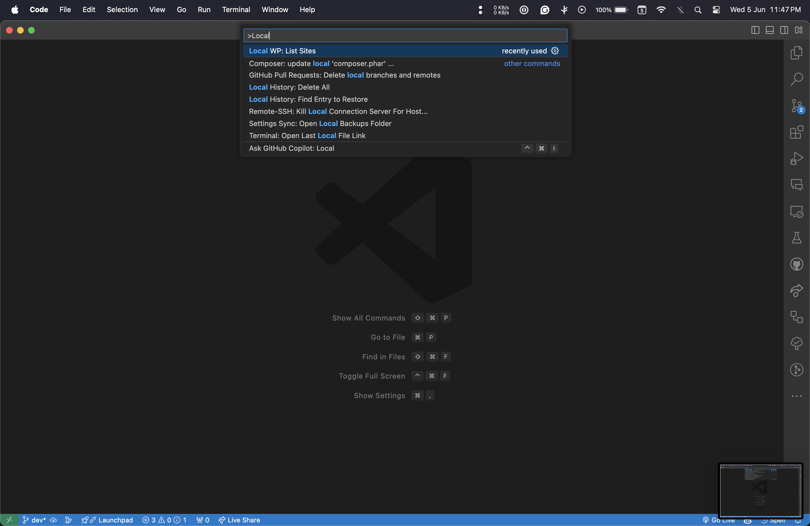
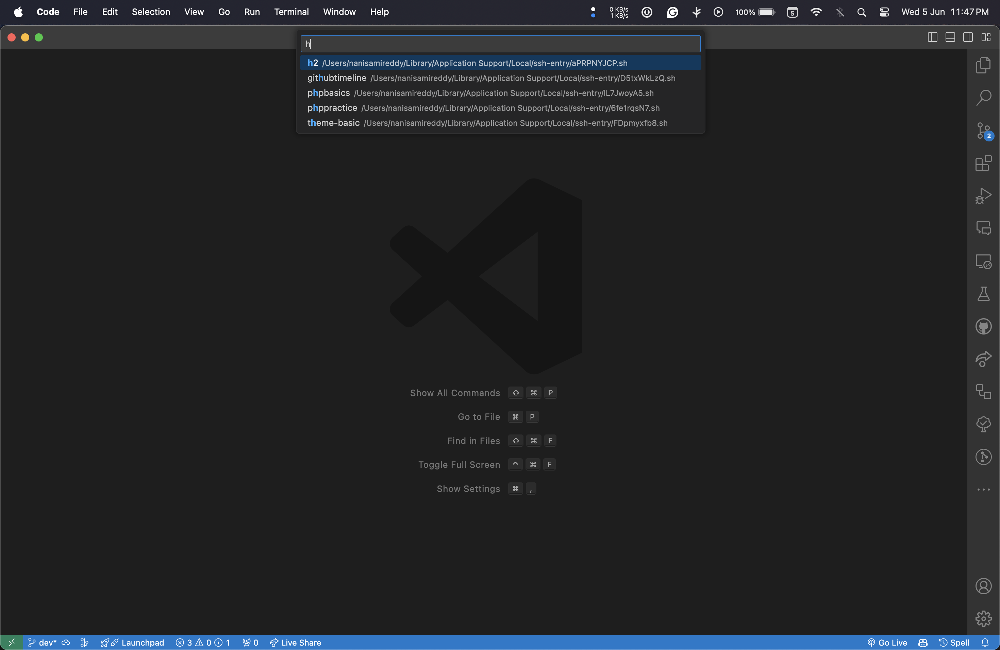
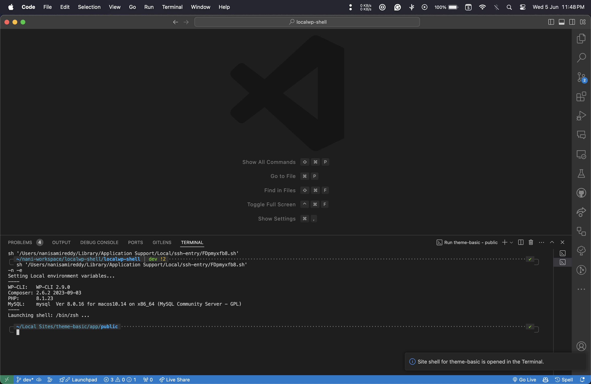

# LocalWP Shells VSCode Extension

**LocalWP Shells** is a VSCode extension designed to streamline the process of opening LocalWP site shells directly within VSCode. This extension simplifies the workflow for developers working with LocalWP by providing quick access to site shells without leaving the editor environment.

## Features

- **List Sites**: Easily list all available LocalWP site shells within your specified folder path.
- **Quick Pick Selection**: Select a site from the listed sites and opens that site's shell in the vscode terminal.
- **Terminal Integration**: Opens the selected site shell in a new terminal window within VSCode.

## Installation

Install through Visual Studio Code Marketplace or by searching for `LocalWP Shells` in the Extensions view search box.

[Visual Studio Code Marketplace - LocalWP Shells](https://marketplace.visualstudio.com/items?itemName=nanisamireddy.localwp-shells)

You can also install the extension by Launching VS Code Quick Open (Ctrl/Cmd + P), pasting the following command, and pressing enter.

```
ext install nanisamireddy.localwp-shells
```

## Usage

1. Configure the folder path where your LocalWP site shells are located in VSCode settings (`localWPShells.folderPath`). If you are on MacOS, the default path is set to `/Users/<username>/Library/Application Support/Local/ssh-entry`.
2. Open the command palette (Ctrl/Cmd + Shift + P) and search for `Local WP: List Sites` or use the shortcut provided by the extension.
3. Select a site shell script from the listed options.
4. The selected site shell will open in a new terminal window within VSCode.

## Screenshots





## Configuration

The extension provides a configuration option to set the folder path where your LocalWP site shells are stored. This can be done by updating the `localWPShells.folderPath` setting in VSCode settings.

## Requirements

- Visual Studio Code version 1.89.0 or higher.
- LocalWP installed on your system.

## Extension Details

- **Name**: LocalWP Shells
- **Version**: 0.0.1
- **Author**: Nani Samireddy
- **Description**: A simple extension that provides an easy way to open LocalWP site shells in VSCode.
- **GitHub Repository**: https://github.com/nani-samireddy/localwp-shell

## Feedback and Contributions

Feedback and contributions are welcome! If you encounter any issues or have suggestions for improvements, please open an issue on the GitHub repository.

Thank you for using LocalWP Shells VSCode Extension! Happy coding! 🚀
